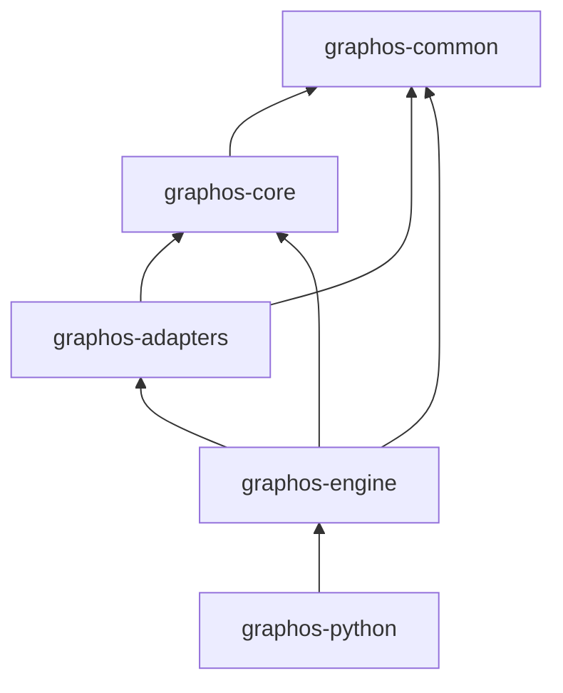

# Crate Structure

Graphos is organized into five crates with clear responsibilities.

## Dependency Graph



## graphos-common

Foundation types and utilities.

| Module | Purpose |
|--------|---------|
| `types/` | NodeId, EdgeId, Value, LogicalType |
| `memory/` | Arena allocator, memory pools |
| `utils/` | Hashing, error types |

```rust
use graphos_common::types::{NodeId, Value};
use graphos_common::memory::Arena;
```

## graphos-core

Core data structures and execution engine.

| Module | Purpose |
|--------|---------|
| `graph/lpg/` | LPG storage (nodes, edges, properties) |
| `index/` | Hash, B-tree, adjacency indexes |
| `execution/` | DataChunk, operators, pipelines |

```rust
use graphos_core::graph::LpgStore;
use graphos_core::index::BTreeIndex;
use graphos_core::execution::DataChunk;
```

## graphos-adapters

External interfaces and adapters.

| Module | Purpose |
|--------|---------|
| `query/gql/` | GQL parser (lexer, parser, AST) |
| `query/cypher/` | Cypher compatibility layer |
| `storage/` | Storage backends (memory, WAL) |
| `plugins/` | Plugin system |

```rust
use graphos_adapters::query::gql::GqlParser;
use graphos_adapters::storage::WalBackend;
```

## graphos-engine

Database facade and coordination.

| Module | Purpose |
|--------|---------|
| `database.rs` | Database struct, lifecycle |
| `session.rs` | Session management |
| `query/` | Query processor, planner, optimizer |
| `transaction/` | Transaction manager, MVCC |

```rust
use graphos_engine::{Database, Session, Config};
```

## graphos-python

Python bindings via PyO3.

| Module | Purpose |
|--------|---------|
| `database.rs` | PyGraphosDB class |
| `query.rs` | Query execution |
| `types.rs` | Type conversions |

```python
import graphos
db = graphos.Database()
```

## Crate Guidelines

1. **No cyclic dependencies** - Strict layering
2. **Public API minimization** - Only expose what's needed
3. **Feature flags** - Optional functionality gated by features
4. **Documentation** - All public items documented
